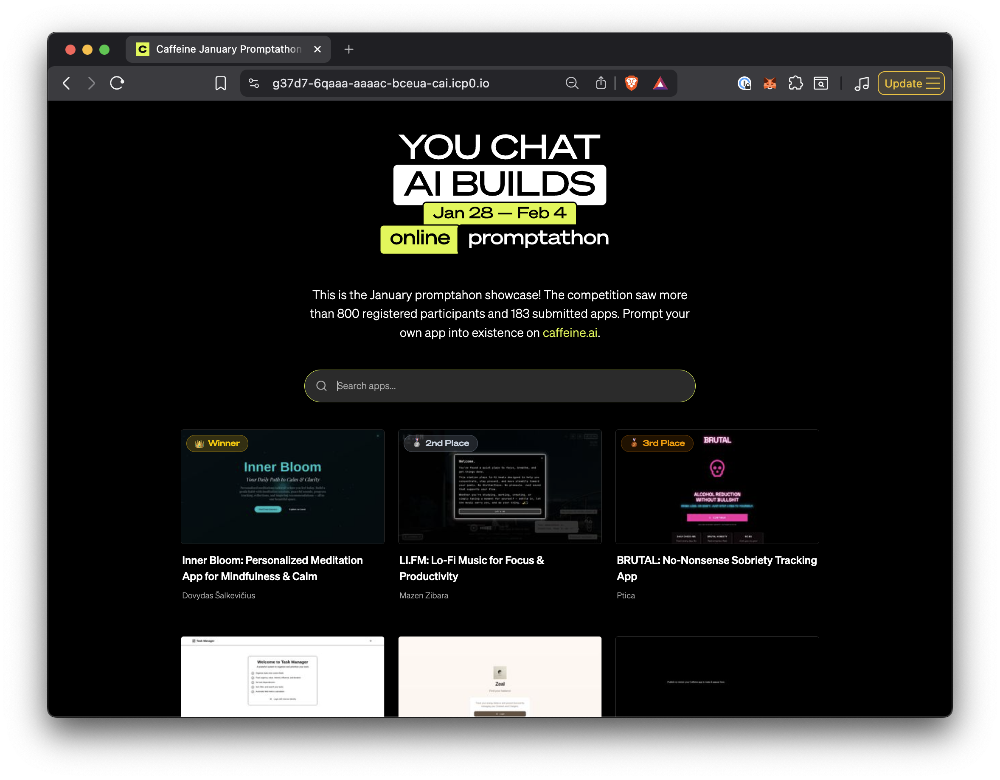

# Promptathon Showcase



The January competition saw more than 800 registered participants and 183 submitted apps. This is the showcase app, a fully on-chain app gallery running on the Internet Computer. Every asset, every database query, every server-rendered page, and every dynamically generated OG image is served directly from a single canister with certified HTTP responses.

## What Makes This Interesting

### Certified HTTP Asset Serving with `ic-asset-router`

All HTTP responses — static and dynamic — are served with IC response certification. Crawlers and social platforms receive cryptographically verifiable responses, the same guarantee that applies to any call on the Internet Computer.

The project uses [`ic-asset-router`](https://github.com/AstronautSergworking/ic-asset-router), a file-based routing library for IC canisters inspired by Next.js conventions. Route handlers are plain Rust functions organized by directory structure:

```
server/src/routes/
├── index.rs              → GET /
├── not_found.rs          → 404 handler
└── app/
    └── _id/
        ├── index.rs      → GET /app/:id
        └── og_png.rs     → GET /app/:id/og_png
```

Route modules, parameter extraction, and handler registration are all generated at build time — no manual wiring needed.

### Dynamic OG Image Generation

Each app gets a unique Open Graph image rendered on-chain. The pipeline:

1. An SVG template is rendered with [MiniJinja](https://github.com/mitsuhiko/minijinja), injecting the app name and title
2. Two bundled fonts (Sohne Breit Halbfett for headings, Sohne Leicht for subtitles) are loaded into a `fontdb` database
3. [resvg](https://github.com/nickel-org/resvg) rasterizes the SVG to a 1200x630 PNG — standard OG image dimensions
4. The result is certified and cached with a 30-day `Cache-Control` header

No external services. The canister generates, certifies, and serves the image.

### Server-Side Rendered Meta Tags

The Vite-built `index.html` contains MiniJinja template placeholders in the `<head>`. Each route handler renders the template with route-specific metadata before serving:

- `/` — static site title and description
- `/app/:id` — app-specific title, description, and OG image URL from the database
- 404 — "Page Not Found" with appropriate status code

This gives crawlers and social platforms (Twitter, Slack, Discord) correct per-page metadata while the client-side React app hydrates normally from `<div id="root">`.

### SQLite Database with Search

App metadata lives in an on-chain SQLite database ([`ic-rusqlite`](https://github.com/AstronautSergworking/ic-rusqlite)). Search queries run `LIKE` pattern matching across four columns — `app_name`, `title`, `author_name`, and `description` — with relevance-ordered results prioritizing name matches.

Database migrations and SQL seed files are managed by `ic-sql-migrate` and baked into the canister at compile time.

### All Assets Embedded in the Canister

The entire frontend build output — JS bundles, CSS, fonts, app screenshots in two resolutions (1500px and 300px), icons, and static images — is embedded into the WASM binary via `include_dir!` at compile time.

Static assets (content-hashed by Vite) are served with `Cache-Control: public, max-age=31536000, immutable` — a one-year cache with immutable hint. Dynamic responses (server-rendered HTML, OG images) use `Cache-Control: public, max-age=2592000` (30 days) and are re-certified on expiry.

### AI-Powered Metadata Enrichment

A build-time indexer crawls submitted app URLs, captures dual-resolution screenshots with Playwright, and enriches metadata using OpenAI or Anthropic. Results are cached incrementally so re-runs skip already-processed apps.

## Quick Start

### Prerequisites

- `dfx` CLI
- Node.js / pnpm
- OpenAI or Anthropic API key

### 1. Start Local Replica

```bash
dfx stop
dfx start --clean --background
```

### 2. Run the Indexer

```bash
cd indexer
pnpm install
pnpm exec playwright install chromium
cp .env.example .env
# Edit .env with your AI API key
pnpm dev
```

This produces:
- `server/src/seeds/seed_apps.sql` — SQL seed data
- `indexer/images/` — Screenshot JPEGs

See [indexer/README.md](indexer/README.md) for details.

### 3. Deploy

```bash
dfx deploy server
```

The deploy pipeline (defined in `dfx.json`):
1. `pnpm run build` — Vite builds the React frontend to `dist/`
2. `cp -r indexer/images dist/images` — copies screenshots into the build output
3. `cargo build` — compiles the Rust canister, embedding `dist/` (including images) via `include_dir!`
4. `wasi2ic` — converts the WASM for IC deployment

### 4. Access the App

```
http://<canister-id>.localhost:4943/
```

### Development

Run the Vite dev server for frontend development with hot reload:

```bash
pnpm run dev
```

Images are proxied to the local canister automatically.

## Tech Stack

| Layer | Technology |
|---|---|
| Frontend | React, TanStack Router, Tailwind CSS, shadcn/ui |
| Backend | Rust canister on the Internet Computer |
| Routing | `ic-asset-router` (file-based, certified) |
| Database | SQLite via `ic-rusqlite` |
| Templating | MiniJinja (SSR meta tags + OG image SVG) |
| OG Images | resvg + tiny-skia (SVG to PNG, on-chain) |
| Indexer | Node.js, Playwright, OpenAI/Anthropic |

## Project Structure

```
.
├── server/                    # Rust canister
│   ├── src/
│   │   ├── lib.rs             # Canister init, HTTP handlers, Candid API
│   │   ├── ogimage.rs         # OG image generation (SVG → PNG)
│   │   ├── page/              # Database models & queries
│   │   ├── routes/            # SSR route handlers (file-based)
│   │   ├── includes/          # Embedded fonts, templates, background image
│   │   └── seeds/             # SQL seed files (generated by indexer)
│   ├── migrations/            # SQLite migrations
│   ├── build.rs               # Route tree + migration codegen
│   └── server.did             # Candid interface
├── src/
│   ├── components/            # React components
│   ├── hooks/                 # React hooks
│   ├── lib/                   # Constants and utilities
│   └── routes/                # TanStack Router file-based routes
├── indexer/                   # Build-time Node.js indexer
│   ├── src/                   # Processing pipeline, AI enrichment, screenshots
│   ├── submissions.csv        # Input data + cached AI results
│   └── images/                # Cached screenshots
├── dfx.json                   # IC deployment config
└── vite.config.ts             # Vite config with canister proxy
```

## API

```candid
service : {
    http_request : (HttpRequest) -> (HttpResponse) query;
    http_request_update : (HttpRequest) -> (HttpResponse);
    list_apps : () -> (vec App) query;
    get_app : (int64) -> (GetAppResult) query;
    search : (text) -> (SearchResult) query;
};
```

## License

MIT
